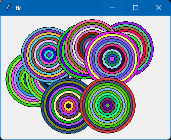
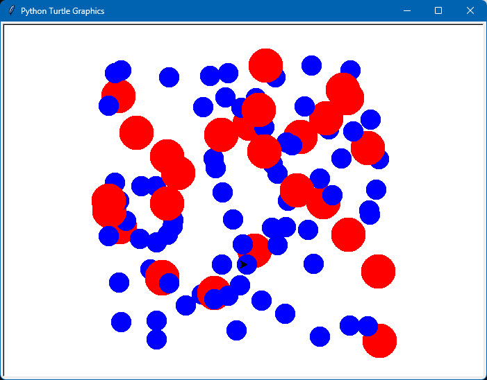
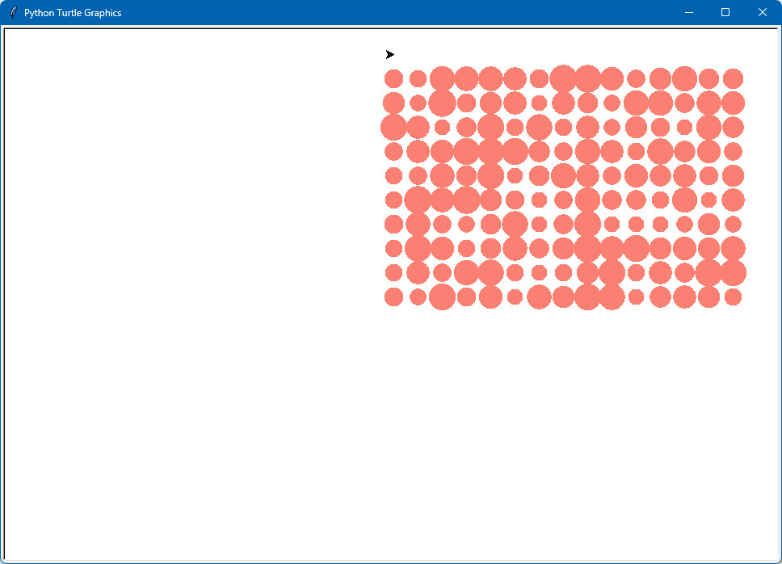
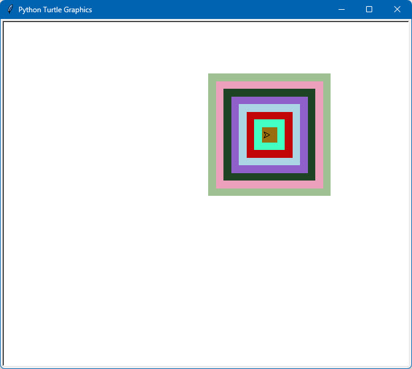
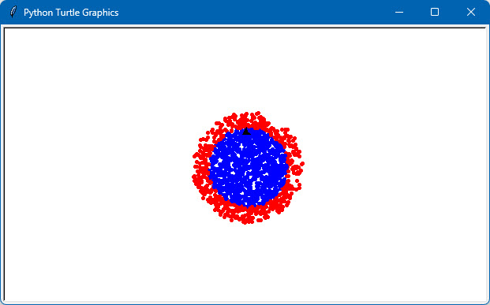
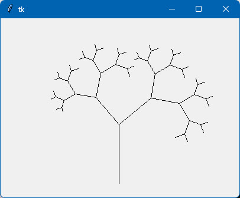

## Cvičení a výpisky Python

Tento repozitář obsahuje dvě složky:

    !Cvičení: Složka obsahující všechna vyhotovená cvičení.
    !Výpisky: Složka obsahující výpisky z jednotlivých lekcí.

Máte-li nainstalovaný Python, pak pro spuštění cvičení postačí na ně dvakrát kliknout.

### Screenshoty

Dále jsem si dovolil přidat pár náhledů na cvičení dělaná v TK Inter a v Želví grafice,
a to hlavně proto, aby bylo vidět, že učit se programovat nemusí být vůbec nudná věc :-)

###### 03_02_hvězdná_obloha

###### 03_03_dva_čtverce_s_popisem

###### 03_05_čtyři_vlajka

###### 03_08_olympijské_kruhy

###### 03_15_vlajka_české_republiky

###### 03_17_přechod_z_červený_do_modrý

###### 03_19_n_úhelník_se_všemi_uhlopříčkami

###### 03_21_vlajka_slovenské_republiky

###### 04_10_gramofonová_deska

###### 04_12_čtverec_v_čtverci_z_teček

###### 04_13_úhlopříčné_trojúhelníky_v_čtverci

###### 04_14_kruh_z_teček

###### 04_15_čtvrtina_kruhu_v_čtverci_z_teček

###### 04_17_vlajka_německa_z_teček

###### 04_18_vlajka_české_republiky_z_teček

###### 04_22_trojúhelníky_v_trojúhelníku

###### 05_09_def_f_autíčka

###### 05_10_def_f_barevné_kruhy

###### 05_12_def_f_domečky

###### 05_13_def_f_3_kruhy_z_teček

###### 05_14a_def_f_čtvercová_síť_náhodných_barev

###### 05_14b_def_f_čtvercová_síť_jednoho_odstínu

###### 05_16_def_f_slunce

###### 05_17_def_f_čáry_z_teček

###### 05_19_def_f_n_úhelníkové_hvězdičky

###### 06_18_sachove_figurky

###### 08_11_barevne_kruhy

###### 08_12_rada_barevnych_tecek

###### 08_13_historogram

###### 10_01_vodorovné_barevne_cary

###### 10_02_zvetsujici_se_zluty_kruh

###### 10_03_barevne_obdelniky

###### 10_04_barevne_spoj_trojuhelniky

###### 10_05_barevne_polygony_s_plusy

###### 10_06_barevne_polygony_bez_plusu

###### 10_08_poradove_cislo_kliknuti

###### 10_09_plocha_jako_barevna_sit

###### 10_10_cerno_bily_kruh

###### 10_11_kreslení_sprejem

###### 10_12_tahani_usecky

###### 10_13_barevné_obdelniky_2

###### 10_15_pohybovani_4_objekty

###### 10_17_kolečko_obíhá_kruh

###### 10_18_kolecko_meni_rychlost_a_smer

###### 10_19_digitalni_hodiny_menici_po_0_1_s

###### 10_21_myzejici_barevna_kolecka

###### 11_00_procházka

###### 11_00_screensaver

###### 11_00_spirála_s_úhlem

###### 11_00_urychlovač_částic

###### 11_00_víc_želv

###### 11_00_zpětná_spirála

###### 11_01_modré_a_červené_tečky

###### 11_02_slunce

###### 11_03_modro_žlutý_terč

###### 11_04_stromová_alej

###### 11_05_barevné_čtverečky_vedle_sebe

###### 11_06_vánoční_hvězda

###### 11_07_3_šikmé_domečky

###### 11_08_barevné_3d_kostky

###### 11_09_vlnovka

###### 11_10_půlbarevná_kolečka

###### 11_11_síť_z_teček

###### 11_12_zapuštěné_barevné_čtverce

###### 11_13_věž_z_kostek

###### 11_14_tři_domy

###### 11_15_pytagorova_věta

###### 11_16_mnohobarevný_36_úhelník

###### 11_17_body_obkreslené_36_úhelníkem

###### 11_18_vytečkování_dvou_kružnic

###### 11_19_50_želviček_do_náhodných_bodů

###### 11_19_100_želviček_do_jednoho_bodu

###### 12_00_ctyrhvezda

###### 12_07_rekurzivní_binární_strom

###### 12_08_rekurzivní_překreslení_čáry

###### 12_09_rekurzivní_vnořené_trojúhelníky

###### 12_10_rekurzivní_vnořené_čtverce

###### 12_11_rekurzivní_kreslení_křížů

###### 12_12_rekurzivní_kreslení_vícerameníku

###### 12_13_plocha_rekurzivních_trojúhelníků

###### 12_14_rekurzivní_pyramida_z_kostiček

###### 12_15_rekurzivní_pyramida_z_kostiček_2

###### 13_00_life

###### 13_12_kreslení_2D_tabulkou

###### 13_13_kreslení_2D_tabulkou_zrcadlo

###### 13_14_kreslení_2D_tabulkou_zvětšení_rastru

###### 13_15_kreslení_2D_tabulkou_nahraď_barvu

###### 13_16_kreslení_2D_tabulkou_kruhy

###### 15_03_trida_stv_pohybující_se_čtverečky

###### 15_04_trida_dvojice_pohybující_se_dvojčtverečky

###### 15_05_trida_klikanie_barevné_tečky_1

###### 15_08_trida_tahanie_barevné_tečky_4

###### 15_10_trida_načti_polygon

###### 16_05_třída_moje_turtle_domečky_1

###### 16_08_třída_moje_turtle_trojúhelníky_2

###### 16_10_třída_korytnačka_2_korytnačka

###### 16_11_třída_korytnačka_3_strom

###### 16_12_třída_korytnačka_4_domečky
